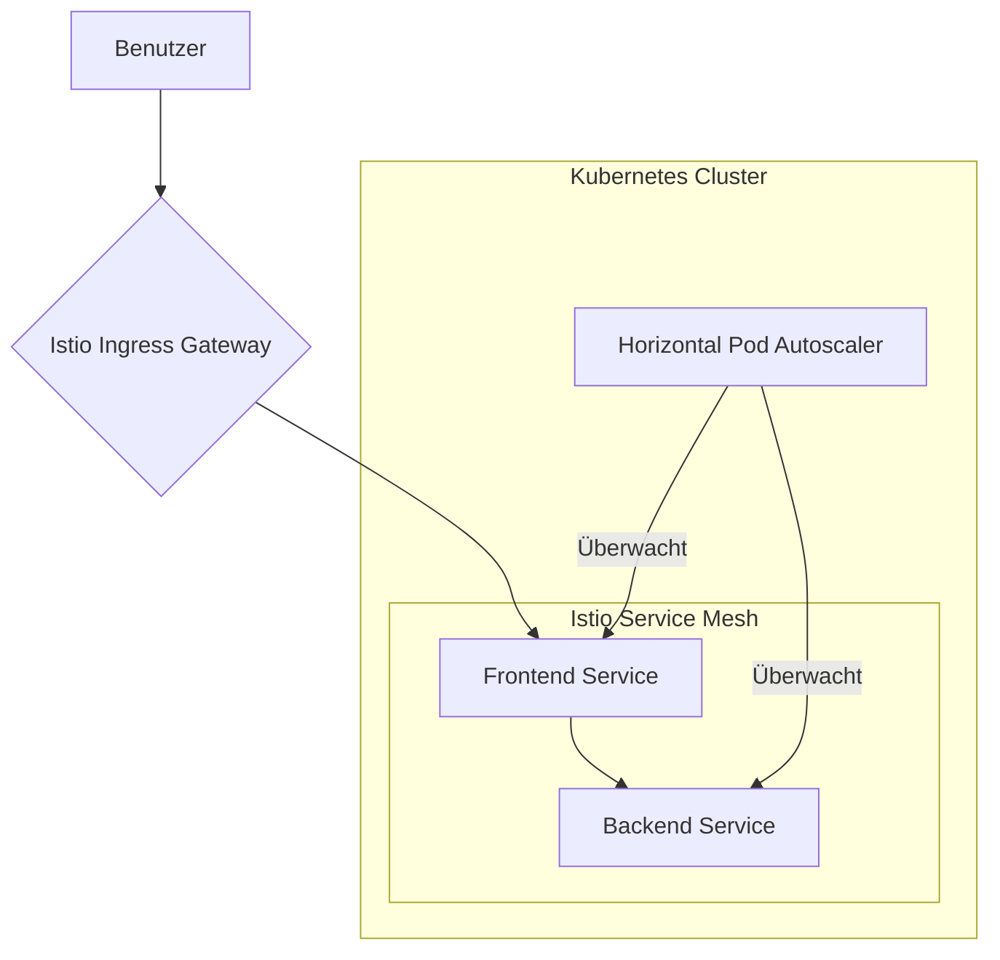

# 🚀 Skalierung mit Präzision - Meisterung der Kubernetes Container-Orchestrierung


> Ein praxisorientiertes Projekt, das eine widerstandsfähige, dynamisch skalierbare Microservices-Architektur durch die Orchestrierung von Docker-Containern auf einem selbstverwalteten Kubernetes-Cluster mit Helm, Istio und intelligenter Autoskalierung demonstriert.

Dieses Repository dokumentiert den Prozess der Containerisierung von Anwendungen mit Docker, deren Bereitstellung auf einem selbstverwalteten Kubernetes-Cluster und deren Verwaltung mit produktionsreifen Werkzeugen. Das Ziel ist es, eine reale, skalierbare Microservices-Umgebung zu simulieren, die praktische DevOps- und SRE-Fähigkeiten für moderne Cloud-Infrastrukturen demonstriert.

---

## 📌 Übersicht

Ich habe eine widerstandsfähige und dynamisch skalierbare Microservices-Architektur orchestriert, indem ich Anwendungen mit Docker containerisiert und auf einem selbstverwalteten Kubernetes-Cluster bereitgestellt habe. Dies umfasste die Konfiguration anspruchsvoller Bereitstellungsstrategien mit Helm-Charts für ein optimiertes Management, die Implementierung eines Service Mesh mit Istio für erweiterte Verkehrssteuerung und Beobachtbarkeit sowie die Einrichtung intelligenter Autoskalierung und nahtloser Rolling Updates zur Gewährleistung hoher Verfügbarkeit.

### Wichtigste Highlights:
*   **Containerisierung mit Docker:** Anwendungen werden in leichtgewichtige, portable Container verpackt.
*   **Orchestrierung mit Kubernetes:** Ein selbstverwalteter Kubernetes-Cluster wird zur Bereitstellung, Skalierung und Verwaltung von containerisierten Anwendungen verwendet.
*   **Optimierte Bereitstellungen mit Helm:** Helm-Charts definieren, installieren und aktualisieren die Anwendung und vereinfachen so das Release-Management.
*   **Service Mesh mit Istio:** Istio bietet erweiterte Verkehrssteuerung (Canary Releases), Beobachtbarkeit und Sicherheit, ohne den Anwendungscode zu ändern.
*   **Intelligente Autoskalierung:** Der Horizontal Pod Autoscaler (HPA) skaliert Pods automatisch basierend auf CPU-/Speichermetriken.
*   **Hohe Verfügbarkeit:** Nahtlose Rolling Updates gewährleisten Bereitstellungen ohne Ausfallzeiten.

---

## 🧩 Architekturdiagramm



*   **Ablauf einer Benutzeranfrage:** Ein Benutzer sendet eine Anfrage, die auf das Istio Ingress Gateway trifft.
*   **Service Mesh:** Istio leitet die Anfrage an den entsprechenden Microservice (z. B. Frontend) weiter. Die Dienste kommunizieren über das Mesh miteinander.
*   **Autoskalierung:** Der Horizontal Pod Autoscaler überwacht die CPU- und Speichernutzung der Pods und skaliert die Anzahl der Replikate automatisch nach oben oder unten.
*   **Bereitstellung:** Alle Komponenten werden als Helm-Charts verpackt und bereitgestellt.

---

## 🛠️ Tech-Stack

| Werkzeug | Zweck |
| :--- | :--- |
| **Docker** | Containerisierung von Microservices. |
| **Kubernetes** | Cluster-Orchestrierung, Ressourcenmanagement und Selbstheilung. |
| **Helm** | Deklarative Anwendungspaketierung und -bereitstellung. |
| **Istio** | Service Mesh für Traffic-Splitting, Beobachtbarkeit und Sicherheit. |
| **Prometheus** | (Über Istio) Metrikerfassung für Überwachung und Alarmierung. |
| **Grafana** | (Über Istio) Visualisierung der Cluster-Gesundheit und Leistungs-Dashboards. |
| **kubectl** | Kommandozeilenwerkzeug zur Verwaltung von Kubernetes. |

---

## 🚀 Erste Schritte: Eine Schritt-für-Schritt-Anleitung

### 1. Voraussetzungen
Sie benötigen die folgenden installierten und konfigurierten Werkzeuge:
*   **Docker:** [Installationsanleitung](https://docs.docker.com/get-docker/)
*   **kubectl:** [Installationsanleitung](https://kubernetes.io/docs/tasks/tools/install-kubectl/)
*   **Helm:** [Installationsanleitung](https://helm.sh/docs/intro/install/)
*   **Ein Kubernetes-Cluster:** Wie z. B. [Minikube](https://minikube.sigs.k8s.io/docs/start/), Kind oder ein Cluster eines Cloud-Anbieters (GKE, EKS, AKS).

### 2. Richten Sie Ihre Umgebung ein
1.  **Klonen Sie das Repository:**
    ```bash
    git clone https://github.com/<your-username>/<your-project>.git
    cd <your-project>
    ```
2.  **Starten Sie Ihren lokalen Kubernetes-Cluster (wenn Sie Minikube verwenden):**
    ```bash
    minikube start --driver=docker
    ```
3.  **Erstellen Sie Docker-Images und pushen Sie diese:**
    *(Für lokales Minikube, richten Sie Ihren Docker-Daemon auf die Minikube-Umgebung aus)*
    ```bash
    eval $(minikube docker-env)
    docker build -t frontend-app:v1 ./frontend
    docker build -t backend-app:v1 ./backend
    ```

### 3. Installieren Sie Istio und bereiten Sie den Namespace vor
1.  **Installieren Sie Istio mit dem Demo-Profil:**
    ```bash
    istioctl install --set profile=demo -y
    ```
2.  **Kennzeichnen Sie den `default`-Namespace für die automatische Istio-Sidecar-Injection:**
    ```bash
    kubectl label namespace default istio-injection=enabled
    ```

### 4. Stellen Sie die Anwendung mit Helm bereit
1.  **Navigieren Sie zum Helm-Chart-Verzeichnis und stellen Sie die Anwendung bereit:**
    ```bash
    helm install my-app ./helm-charts/my-app
    ```
    Sie können den Status der Bereitstellung mit `kubectl get pods,svc,deployment` überwachen.

### 5. Beobachten und Testen
1.  **Autoskalierung testen:**
    Erzeugen Sie Last auf einem Dienst, um den Horizontal Pod Autoscaler auszulösen.
    ```bash
    # In einem Terminal, beobachten Sie den HPA
    kubectl get hpa -w

    # In einem anderen Terminal, starten Sie einen Lastgenerator
    kubectl run -i --tty load-generator --image=busybox /bin/sh
    # Innerhalb der Pod-Shell:
    # while true; do wget -q -O- http://frontend-service; done
    ```
    Sie werden sehen, wie die Anzahl der Pod-Replikate steigt, um die Nachfrage zu decken.

2.  **Führen Sie ein Rolling Update durch:**
    Um eine neue Version ohne Ausfallzeit bereitzustellen, aktualisieren Sie den Image-Tag in Ihrer `values.yaml`-Datei und führen Sie ein Helm-Upgrade durch.
    ```bash
    # In helm-charts/my-app/values.yaml, ändern Sie den Image-Tag auf v2
    helm upgrade my-app ./helm-charts/my-app
    ```
    Überwachen Sie den Rollout-Status:
    ```bash
    kubectl rollout status deployment/frontend-app-deployment
    ```

3.  **Implementieren Sie ein Canary Release:**
    Wenden Sie einen Istio `VirtualService` an, um den Verkehr zwischen zwei Versionen Ihrer Anwendung aufzuteilen. Um beispielsweise 10 % des Verkehrs an `v2` zu senden:
    ```yaml
    # canary-release.yaml
    apiVersion: networking.istio.io/v1alpha3
    kind: VirtualService
    metadata:
      name: my-app-virtualservice
    spec:
      hosts:
        - "my-app.example.com" # Ersetzen Sie dies durch Ihren Host
      http:
      - route:
        - destination:
            host: frontend-service
            subset: v1
          weight: 90
        - destination:
            host: frontend-service
            subset: v2
          weight: 10
    ```
    Wenden Sie das Manifest an: `kubectl apply -f canary-release.yaml`.

---

## 📂 Repository-Struktur

```
/
├── .github/workflows/      # (Optional) CI/CD-Pipelines
├── frontend/               # Quellcode und Dockerfile für Frontend
├── backend/                # Quellcode und Dockerfile für Backend
├── helm-charts/my-app/     # Helm-Chart für die Anwendung
├── istio-configs/          # Istio Gateway und VirtualService-Manifeste
└── README.md
```

##  Beiträge

Beiträge sind willkommen! Bitte fühlen Sie sich frei, einen Pull Request einzureichen oder ein Issue zu öffnen.
